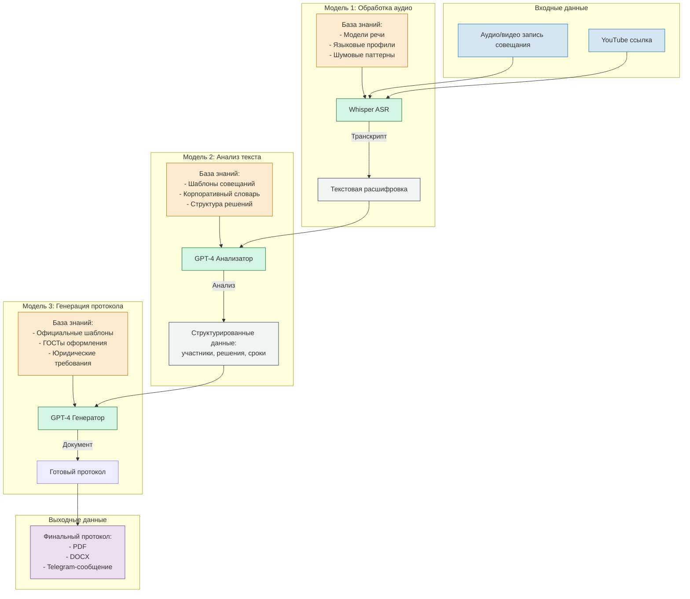

Вот схематичное представление структуры нейро-сотрудника для вашего проекта с использованием трех GPT-моделей:



### Описание блоков:

1. **Модель 1: Whisper ASR (Audio Processing)**  
   - Преобразует аудио/видео в текст
   - Использует:
     - Акустические модели для 100+ языков
     - Шумоподавление
     - Диаризацию (разделение речи по спикерам)
   - Вход: аудиофайлы (MP3/WAV) или YouTube-ссылки
   - Выход: сырая текстовая расшифровка

2. **Модель 2: GPT-4 Анализатор**  
   - Выделяет структуру совещания:
     ```python
     {
         "participants": ["Иван А. (CEO)", "Мария С. (CTO)"],
         "decisions": [
             {"text": "Запуск проекта X", 
              "responsible": "Мария С.",
              "deadline": "2024-06-30"}
         ]
     }
     ```
   - Использует:
     - Корпоративный глоссарий
     - Шаблоны принятия решений
     - Контекстный анализ

3. **Модель 3: GPT-4 Генератор**  
   - Создает документы по ГОСТ Р 7.0.97-2016:
     - Протоколы
     - Выписки
     - Резолюции
   - Поддерживает форматы:
     - PDF (с водяными знаками)
     - DOCX (для редактирования)
     - HTML (для веб-публикации)

### Взаимодействие моделей:
1. Пользователь загружает аудио → Whisper создает транскрипт
2. Транскрипт анализируется → извлекаются структурированные данные
3. Данные передаются генератору → формируется финальный документ
4. Протокол отправляется через Telegram API

Для следующего этапа можно добавить:
- Скриншоты промежуточных результатов обработки
- Примеры JSON-структур анализа
- Сравнение разных версий протоколов
- Визуализацию временных меток в аудио
